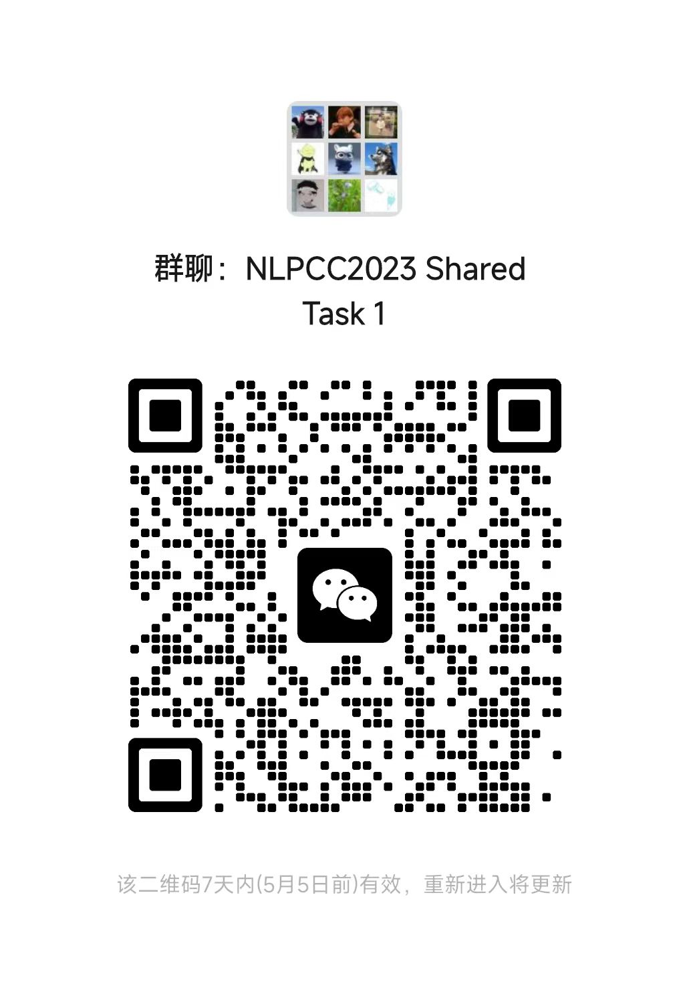

# NLPCC2023 Shared Task 1: Chinese Grammatical Error  Correction

## Task Introduction

Chinese Grammatical Error Correction (CGEC) aims to automatically correct grammatical errors that violate language rules and converts the noisy input texts to clean output texts. The widely used benchmarks are derived from the grammatical errors made by foreign Chinese learners (i.e., L2 learners). The gap between the language usage habits of L2 learners and Chinese native speakers makes the performance of the CGEC models in real scenarios unpredictable.  This task focuses on correcting grammatical errors made by Chinese native speakers, which will be a challenging benchmark and a meaningful resource to facilitate further development of CGEC.

## Updates

All updates about this shared task will be posted on this page.

## Important Dates

- 2023/03/15：registration open
- 2023/04/06：release of detailed task guidelines & training data
- 2023/05/05：registration deadline
- 2023/05/21：release of test data
- 2023/05/31：participants’ results submission deadline
- 2023/06/10：evaluation results release and call for system reports and conference paper

## Data Description & Rules

We provide a CGEC benchmark named *NaCGEC*, which focuses on grammatical errors made by native Chinese speakers. In this task, the benchmark data is split into two parts: Validation and Test.

- Validation: `nacgec.dev.ref.para` (put in `data`) includes 500 sentences and corresponding correct sentences sampled from the original dataset. **The validation set can be utilized for model performance testing and hyper-parameter tuning, but it cannot be directly used for model training. Each line of `nacgec.dev.ref.para` contains one training sample, and the format of a line is `<id>\t<source>\t<target1>\t<target2>...\n`. If `<target1>` and `<source>` in a line are the same, the `<source>` does not contain grammatical errors.**
- Test: `nacgec.test.input` (will be released at 05/21) includes 5869 sentences that may contain grammatical errors. Participants should use CGEC model to detect and correct each sentence and output the correct sentence.

**For model training, only the data provided by [this link](https://cloud.tsinghua.edu.cn/f/9e46b10b52564736b0f3/) is allowed to be used as supervised data, i.e, parallel data, which includes [Lang8](http://tcci.ccf.org.cn/conference/2018/taskdata.php), [HSK](https://cloud.tsinghua.edu.cn/f/9e46b10b52564736b0f3/),  [CGED](https://github.com/blcuicall/cged_datasets), [MuCGEC](https://github.com/HillZhang1999/MuCGEC), [YACLC](https://github.com/blcuicall/YACLC) and [CTC2021](https://github.com/destwang/CTC2021), in this shared task. When using these data, please follow the rules set by the original data publisher.** Meanwhile, **for unsupervised data, any corpus publicly available on the web is allowed to be used. **Based on unsupervised data, participants can use any data augmentation methods, such as [our work](https://github.com/masr2000/CLG-CGEC) or other methods, to construct pseudo-parallel data for model training.

For more information related to this dataset, please refer to our paper: [Linguistic Rules-Based Corpus Generation for Native Chinese Grammatical Error Correction](https://arxiv.org/pdf/2210.10442.pdf). If there are any differences between the paper and this page, the content of this page should prevail.

## Submission & Evaluation

For submission, the following materials should be packaged as one `zip` file and sent to masr21@mails.tsinghua.edu.cn:

- Submission File: The output sentences should be written into one text file. **The format of submission file must be the same as the input file. Specifically, the submission file must contain the same number of lines as the input file, and each line is a correct sentence corresponding to the sentence in the input file.** we also provide a submission sample file to show the format. 
- Code: The code folder should contain all the codes of data augmentation, data processing, model training and model inference. 
- Document: 
  - **Data Description: The document needs to contain a brief description of supervised and unsupervised data used in the experiment, as well as the data augmentation methods for unsupervised data.**
  - **Sharing Link of Unsupervised Data: Unsupervised data used in the experiment should be uploaded to a cloud storage, i.e., net disk, and the sharing link should be included in the document.** It is not allowed to use data that violates the rules during model training.
  - **Code Reproduction Process: The submitted code may be checked and reproduced by us, so please briefly explain the process of reproducing the code in the document.** 

For evaluation, we employ both word-based metrics and char-based span-level metrics. **For word-based metrics, an output sentence should be segmented into words using [THULAC](https://github.com/thunlp/THULAC-Python) toolkit, and then we utilize [MaxMatch](https://github.com/nusnlp/m2scorer) ($\text{M}^2$) scorer to compute Precision, Recall and $\text{F}_{0.5}$ between the output sentence and gold edits. For char-based span-level metrics, we use [ChERRANT](https://github.com/HillZhang1999/MuCGEC) to obtain the evaluation results. The final score is the average of $\text{F}_{0.5}$ scores obtained by word-based and char-based metrics, i.e., $\text{score}=0.5\cdot\text{F}_{0.5}\text{(word)}+0.5\cdot\text{F}_{0.5}\text{(char)}$.**

The top 3 participating teams will be certificated by NLPCC and CCF-NLP.

## Participants

| Team ID | Organization                                                 | System Name  |
| ------- | ------------------------------------------------------------ | ------------ |
| 1       | Natural language processing laboratory of zhengzhou university | ZZUNLP       |
| 2       | MOE Key Laboratory of Computational Linguistics, School of Computer Science, Peking University | CGEC先遣队   |
| 3       | NanKai University, College of Computer Science, DBIS         | NLP Beginner |
| 4       | Harbin Institute of Technology, Shenzhen ; School of Computer Science and Technology ; HappyTrans@HITsz | HappyTrans   |
| 5       | School of Computer Science & Technology, Beijing Institute of Technology | zhao jia     |
| 6       | Wangxuan Institute of Computer Technology, Peking University | PKU-WICT     |
| 7       | 杭州十域科技有限公司                                         | jojolee      |
| 8       | 北京大学                                                     | 鱼饼啾啾Plus |
| 9       | Beihang University                                           | BUAA NLP     |
| 10      | 上海哔哩哔哩科技有限公司                                     | chole        |

## Contact & Citation

If your publication employs our dataset, please cite the following article:

```\
@inproceedings{ma2022linguistic,
  title={Linguistic Rules-Based Corpus Generation for Native Chinese Grammatical Error Correction},
  author={Ma, Shirong and Li, Yinghui and Sun, Rongyi and Zhou, Qingyu and Huang, Shulin and Zhang, Ding and Yangning, Li and Liu, Ruiyang and Li, Zhongli and Cao, Yunbo and others},
  booktitle = {Findings of the Association for Computational Linguistics: EMNLP 2022},
  year={2022}
}
```

If you have any questions about this task, please email to masr21@mails.tsinghua.edu.cn (C.C. liyinghu20@mails.tsinghua.edu.cn, zheng.haitao@sz.tsinghua.edu.cn).

Or you can scan the QR code to join the following WeChat group:


